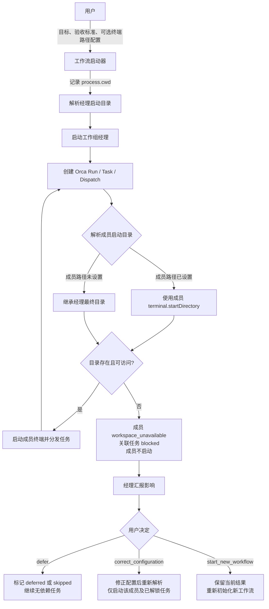
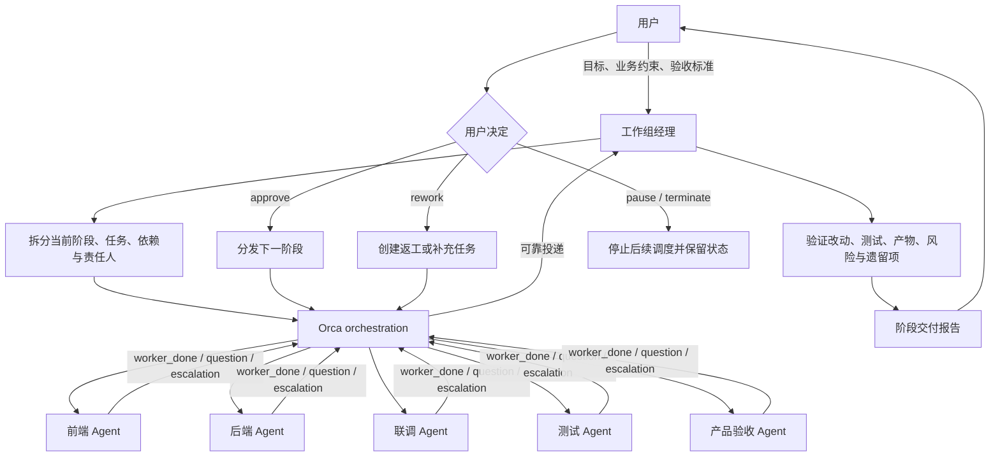
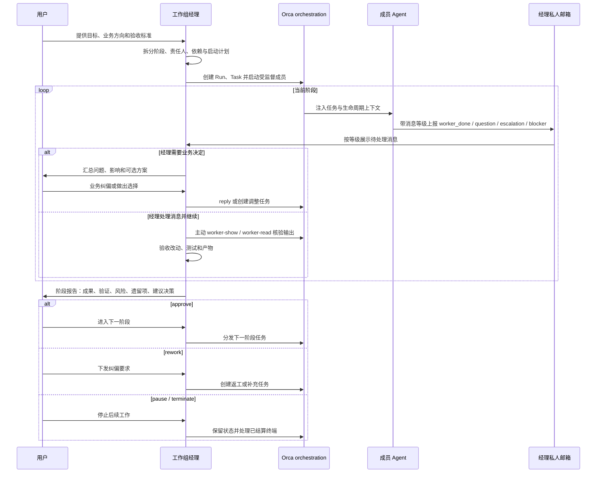

# 工作组终端启动、Orca 编排与阶段交付流程

> **状态**：声明式工作流设计。当前仅提供流程规范与配置示例，尚未提供读取该配置、启动终端或调用 Orca 的执行器。
>
> **范围**：定义工作组、经理 Agent、成员 Agent、终端启动目录、Orca orchestration 通信、阶段交付和用户决策。
>
> **不在范围内**：项目目录创建、代码仓库、分支、隔离目录与版本控制策略。

## 1. 参与者与职责

| 参与者 | 职责 |
|---|---|
| 用户 | 提供目标、验收标准与业务约束；在阶段交付时选择通过、打回、暂停或终止；在成员目录不可用时做后续决策。 |
| 工作组经理 | 工作组唯一的用户沟通入口；拆分阶段、安排依赖、启动成员、创建并监督 Orca Run / Task / Dispatch、汇总验证证据与阶段交付；手动读取经理邮箱，按已确认基线和消息等级处理消息。 |
| 成员 Agent | 在自身已解析的终端启动目录中执行经理分配的任务；向经理邮箱发送带消息等级（`worker_done` / `question` / `escalation` / `blocker`）的消息；通过白名单与同行协作。 |
| 经理私人邮箱（managerInbox） | 经理专属收件箱；只接收成员消息并按等级展示，**不**调度、**不**纠偏、**不**巡视、**不**向用户汇报。 |
| Orca orchestration | 提供 Run、Task、Dispatch、可靠消息、`worker_done`、`question`、`escalation` 与受监督终端生命周期。 |

成员可以使用不同的启动目录；目录只决定终端从哪里启动，不是任务隔离、文件所有权或验收边界。经理仍须按阶段和任务安排成员协作。

## 2. 终端启动目录契约

经理与每个成员均可单独设置 `terminal.startDirectory`。启动一个成员终端前，按以下固定优先级解析目录：

```text
成员 terminal.startDirectory
  > 经理 terminal.startDirectory
  > 工作流启动器的当前目录 process.cwd()
```

| 经理路径 | 成员路径 | 经理最终目录 | 成员最终目录 |
|---|---|---|---|
| 已设置 | 已设置 | 使用经理路径 | 使用成员路径 |
| 已设置 | 未设置 | 使用经理路径 | 继承经理最终目录 |
| 未设置 | 已设置 | 使用 `process.cwd()` | 使用成员路径 |
| 未设置 | 未设置 | 使用 `process.cwd()` | 继承经理最终目录，即 `process.cwd()` |

### 2.1 继承与失败的区别

- **字段未设置**：才允许进入下一级回退或继承。
- **字段已设置但路径不存在、无访问权限或不满足启动条件**：该成员的目录解析失败，**不得**继续回退到经理目录或 `process.cwd()`。
- 每个终端的最终目录应在启动前记录；已启动的终端不因配置或文件系统后续变化而静默迁移。

## 3. 启动、目录校验与用户决策



### 3.1 目录不可用时的状态

| 对象 | 状态 | 处理 |
|---|---|---|
| 成员 | `workspace_unavailable` | 不启动该成员终端。 |
| 直接关联任务 | `blocked` | 不调度，等待用户决定。 |
| 不依赖该成员的任务 | 保持可执行 | 经理可继续安排。 |
| 用户选择暂缓后的任务 | `deferred` 或 `skipped` | 在阶段交付中明确列为缺口。 |

经理不得猜测替代路径、静默切换到经理目录、修改成员配置、自动创建目录、自动创建新工作流，或不经说明就将该成员的写任务交给其他成员。

经理应按以下格式通知用户：

```text
成员：backend-engineer（后端）
解析后的启动目录：D:/OB/bi-FOB/bi-cashier
状态：workspace_unavailable（路径不存在或不可访问）
影响：接口开发、联调与相关测试任务被阻塞
不受影响：前端分析、产品范围确认
请决定：defer / correct_configuration / start_new_workflow
```

## 4. 经理主导的阶段编排



一个工作组会话中，概念对应如下：

| Orca 概念 | 工作组含义 |
|---|---|
| Run | 当前工作组的一次协作会话。 |
| Task | 经理拆分出的可验收任务。 |
| Dispatch | 某成员对某 Task 的一次执行尝试。 |
| `worker_done` | 成员的一次成功或失败执行结果。 |
| `question` | 成员需要经理或用户给出决定。 |
| `escalation` | 成员无法自行处理的风险、冲突或阻塞。 |

经理通过 `orca orchestration check --wait` 等待并消费成员事件；不能只依据终端退出判断任务已经完成。

### 4.1 经理定期巡视与技术偏差纠正

用户与经理在工作组启动的当前 session 中，已经共同确认执行计划、需求、技术方案和验收标准。经理按组员技能将这些内容拆成 Task，并把当前任务范围、方案要点和验收条件随 Orca Task / Dispatch 注入成员上下文；**不在 YAML 固化需求或技术方案文件路径**。

经理对每个运行中的成员 Dispatch 按配置的固定间隔巡视：

```text
worker-show：确认成员是否仍在运行、是否等待输入、是否已失败或停止
worker-read：用上次返回的 cursor 读取新增 transcript / terminal 输出
对照：当前 session 的已确认基线 + 该 Task / Dispatch 的任务上下文
结论：符合 / 轻微偏差 / 明显偏差
```

| 巡视结论 | 经理动作 | 是否通知用户 |
|---|---|---|
| 符合当前基线 | 记录巡视结果，继续执行。 | 否 |
| 轻微偏差 | 向精确的 `dispatch:<dispatchId>` 发送纠偏指令；下次巡视复验。 | 否 |
| 明显偏差但基线足够明确 | 要求停止扩展修改、修正或回退；必要时拆分、重排或重新分派技术任务。 | 否 |
| 组员无法按既定方案完成 | 经理调整技术任务、协作关系或责任人，并继续验证。 | 否 |
| 需求目标、验收标准或业务优先级本身需要改变 | 汇总影响和选项后向用户提问。 | 是 |

巡视属于经理的内部执行管理。`worker_done`、`question`、`escalation` 仍必须让经理可见；成员直接通信白名单只允许协作信息同步，不能绕过巡视、任务控制、经理验证或用户的业务决策权。

### 4.3 经理私人邮箱（managerInbox）的职责与边界

经理私人邮箱是经理专属的消息收件箱，与 `members` 平级但**不是成员**，不计入 `memberCommunication.allowedPairs`：

- **只接收成员发来的消息并按等级展示**，不做分类、不做总结、不做转发。
- **不调度**：邮箱不能创建 Task / Dispatch。
- **不纠偏**：邮箱不能向成员发送任何技术指令；纠偏由经理手动读取后亲自发出。
- **不巡视**：邮箱不能主动调用 `worker-show` / `worker-read`。
- **不向用户汇报**：邮箱没有用户沟通能力，任何用户决策必须由经理整理后提出。

消息等级在 `spec.managerInbox.messageLevels` 声明，组员在发往邮箱的消息上必须打上其中之一；邮箱按 `order` 升序展示，数字越小越靠前：

| 等级名 | 适用场景 | `order`（示例） |
|---|---|---|
| `blocker` | 启动目录 / 命令不可用、阻塞无法继续，等级最高。 | 0 |
| `question` | 成员需要经理或用户做出决定。 | 10 |
| `escalation` | 成员遇到无法自行处理的风险、冲突或阻塞。 | 20 |
| `worker_done` | 成员完成一次执行后回报结果，等级最低。 | 30 |

`messageLevels` 数组声明顺序必须与 `order` 升序一致；邮箱视图按 `order` 从小到大自顶向下展示，经理自行决定处理顺序与时机。

终端启动目录解析沿用同一套：`managerInbox.terminal.startDirectory > manager.terminal.startDirectory > 启动器 process.cwd()`。邮箱目录或命令不可用时，按 §3 的"目录/命令不可用"流程阻塞并交由用户决策，不得静默回退或绕过。

## 5. 用户、经理与成员的时序



## 6. 阶段交付与验收

`worker_done` 是成员任务的权威执行结果，但不是用户接受交付的结论。经理在向用户提交阶段报告前，至少应汇总：

1. 已完成、失败、阻塞、暂缓的任务；
2. 测试或其他验证证据；
3. 已产生的交付物；
4. 已知风险和未完成项；
5. 下一步建议，以及需要用户决定的事项。

用户决策与经理动作对应关系：

| 用户决策 | 经理动作 |
|---|---|
| `approve` | 解锁并分发下一阶段的可执行任务。 |
| `rework` | 根据纠偏要求创建返工或补充任务。 |
| `pause` | 不再启动后续任务，保留工作流状态供后续恢复。 |
| `terminate` | 停止后续调度，汇总当前结果与未完成项。 |
| `defer` | 仅用于不可用成员或其任务；记录缺口并继续无依赖工作。 |
| `correct_configuration` | 修正路径配置后，仅重新校验受影响成员和其下游任务。 |
| `start_new_workflow` | 保留当前工作流已获得的结果，不自动迁移状态，重新初始化新工作流。 |

## 7. 配置与运行时状态的边界

完整示例见 [workgroup.example.yaml](./workgroup.example.yaml)。配置只声明角色、可选启动目录、阶段任务、用户控制和交付要求。

以下内容属于运行时派生状态，不写回示例配置：

- 最终解析后的启动目录；
- 成员状态、任务状态；
- Run、Task、Dispatch 标识；
- 终端句柄、进程标识；
- 事件游标、测试输出与阶段报告内容。

该示例**不能**作为本目录现有 `workflow-runner.mjs` 的输入；现有 runner 使用另一套配置结构和执行语义。

## 8. 不变量

1. 一个工作组有且只有一名经理，经理是用户唯一的协调入口。
2. 成员路径 > 经理路径 > 启动器 `process.cwd()` 的解析顺序不可改变。
3. 只有未设置路径才会继承；已设置但不可用的路径必须阻塞成员启动。
4. 成员目录不可用时，经理必须上报影响并等待用户的三种明确选择，不能自行修复或绕过。
5. 目录不同不改变经理对任务阶段、依赖、文件所有权和验收的管理职责。
6. `worker_done` 不等于阶段交付完成；只有经理验证并经用户决策后才能推进阶段。
7. 工作组配置不承载项目目录创建、仓库、分支或版本控制规则。
